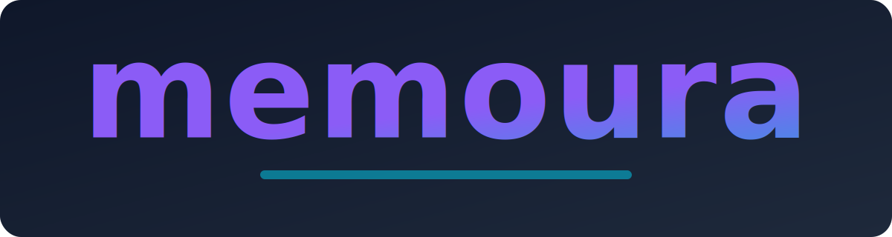

<p align="center">
  
</p>

# Memoura

A student-first note-taking and productivity app.  
Built with **Electron + React + TypeScript + TailwindCSS**.

---

## Requirements
To run Memoura locally, you’ll need:
- [Node.js (LTS recommended)](https://nodejs.org/) — comes with `npm`
- [Git](https://git-scm.com/)
- Any text editor
- Works on: mac os, windows, or Linux

### Optional: Electron
Right now Memoura runs perfectly in the **browser** using the Vite dev server.  
Electron is only needed if you want to run Memoura as a **desktop app**:

- **Without Electron** → run `npm run dev` and open [http://localhost:5173](http://localhost:5173).  
- **With Electron** → launch Memoura in a desktop window (like a real app).  
- **For Final Product** → Electron will also allow packaging Memoura as an installer (`.exe`, `.dmg`, `.AppImage`).  

> **Important:** For early development, you don’t need Electron. Add it whenever you’re ready for desktop features... or never add it at all if you just want the browser version. (This is a uni project after all!)

---

## Development

### Getting Started (for mac, windows, and linux)
```bash
# clone the repo
git clone https://github.com/SJSUgavinnguyen/Memoura.git
cd Memoura

# make sure you are in the main folder and install dependencies
npm install       // Windows only: If you get an error along the lines of "cannot be loaded beucase running scripts is diabled on this system", open powershell and use this command: Set-ExecutionPolicy -Scope CurrentUser -ExecutionPolicy RemoteSigned

# start the Vite dev server
npm run dev
